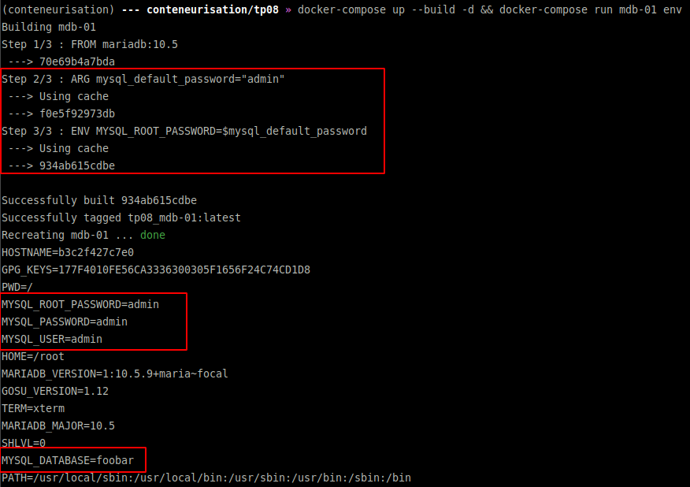
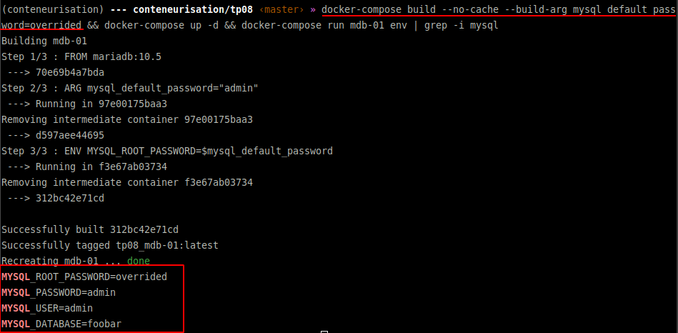

# Conteneurisation M2 TP08

## Les variables d'env dans les Dockerfile/Compose

Dans ce repository on peut trouver plusieurs choses : 
- 1 docker-compose [ici](docker-compose.yaml)
* 1 Dockerfile [ici](Dockerfile)
* 1 fichier stockant des variables d'environnement [ici](.env)

* run the project.
```bash
docker-compose up --build -d && docker-compose run mdb-01 env
```

* proof-01 - Defaults values


* proof-02 - Overriding `MYSQL_ROOT_PASSWORD` with `--build-arg`

